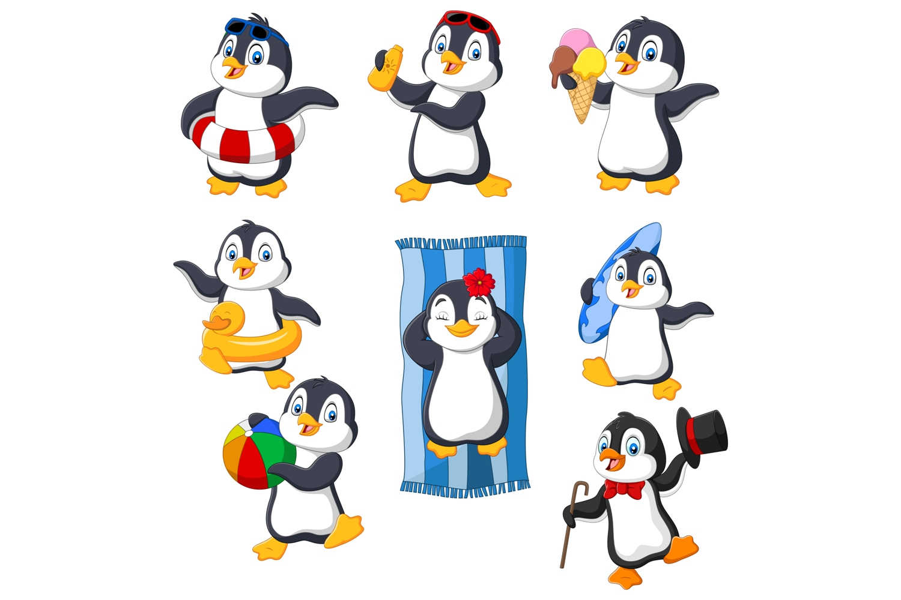

```{r setup, include = FALSE} 
knitr::opts_chunk$set(echo = TRUE, warning=FALSE, fig.path = '../Output/') #GLOBAL CHUNK: setting specific arguments and directing where all the figures would go
```
# Intro
In this lab, we are creating a table and a figure in the *Rmarkdown* file.

# Load Libraries
**NOTE:** Loading all the libraries needed for this Rmarkdown file.
```{r, warning=FALSE, message=FALSE} 
library(tidyverse) 
library(here)
library(kableExtra)
library(palmerpenguins)
```

# Inspecting the data
```{r}
penguins %>% #calling the dataframe to be analyzed
  group_by(island) %>% #grouping by the island
  #taking the average of the billmean, billdepth, and bodymass
  summarise(billmean_mm=mean(bill_length_mm, na.rm=TRUE), 
            billdepth_mm=mean(bill_depth_mm, na.rm=TRUE),
            bodymass_g=mean(body_mass_g, na.rm=TRUE)) %>% 
  kbl() %>% #make it a kable table
  kable_classic() %>% #setting the theme of the kable to be classic
  kable_material(c("hover")) #adding an interactive kable table where this highlights when you hover the row
```
**TABLE:** I am creating a kable table to view the data by the island's avearge. 



# Making a plot
```{r Penguin2, fig.width=8, fig.height=3, fig.align="center"}
penguins %>% #calling the dataframe to be analyzed
  ggplot (aes(x=island, #setting what goes to the horizontal axis
              y=body_mass_g, #setting what goes to the vertical axis
              color=species)) + #coloring the species (see the difference of each)
  geom_jitter() + #adding a jitter plot
  labs(x="Island", #naming the horizontal axis
       y="Body mass (g)") + #naming the vertical axis
  guides(color=FALSE) + #getting rid of the legend
  theme_bw() + #setting the theme of the plot to be black and white
  facet_grid(~species) #facetting by species (by column)
```

**FIGURE:** In making this plot, I group the penguins by their species. They are:  

  1. Adelie  
  1. Chinstrap    
  1. Gentoo  